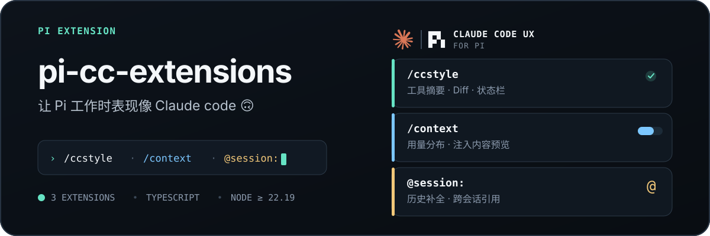
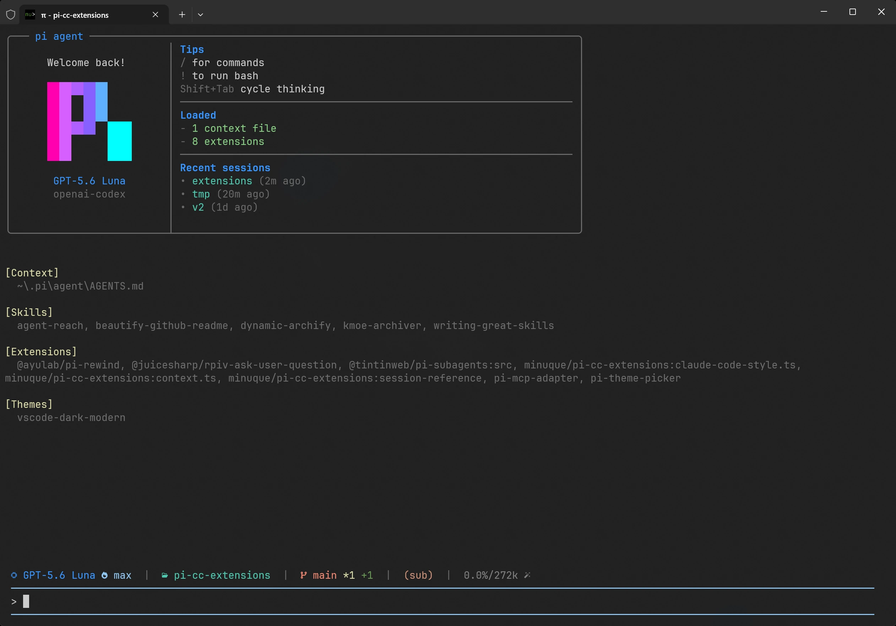
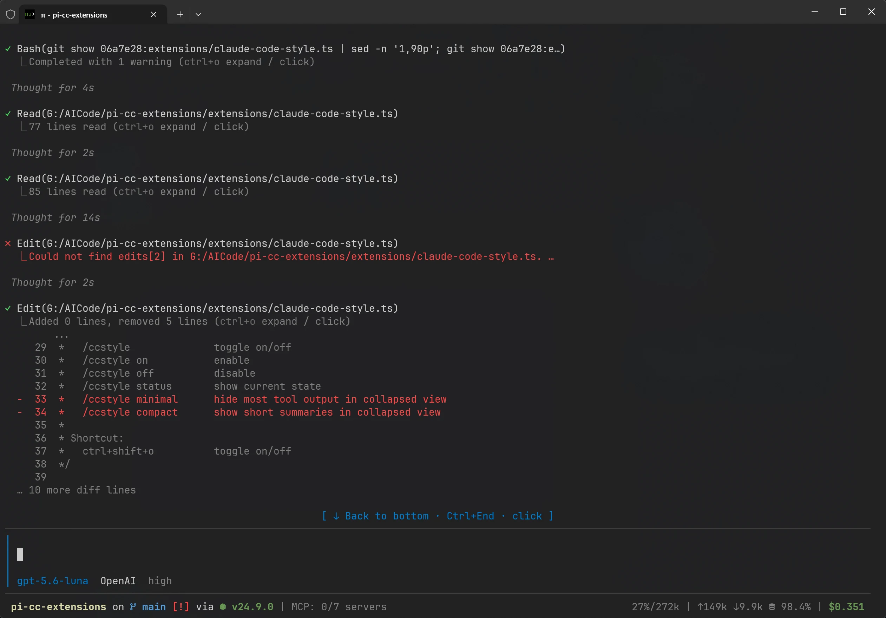
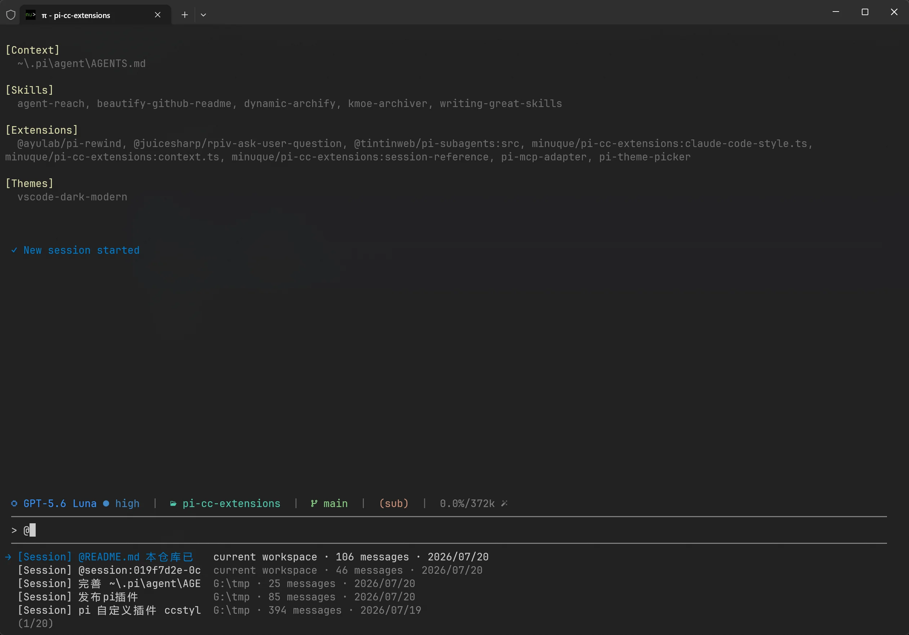
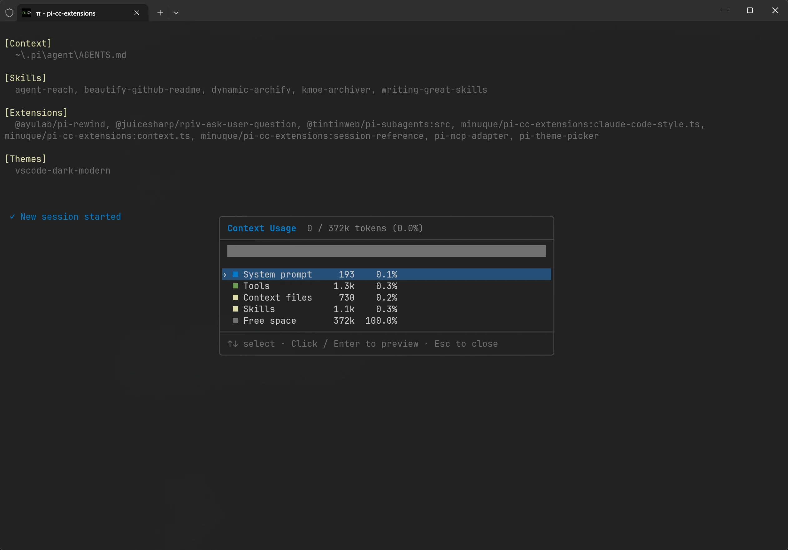
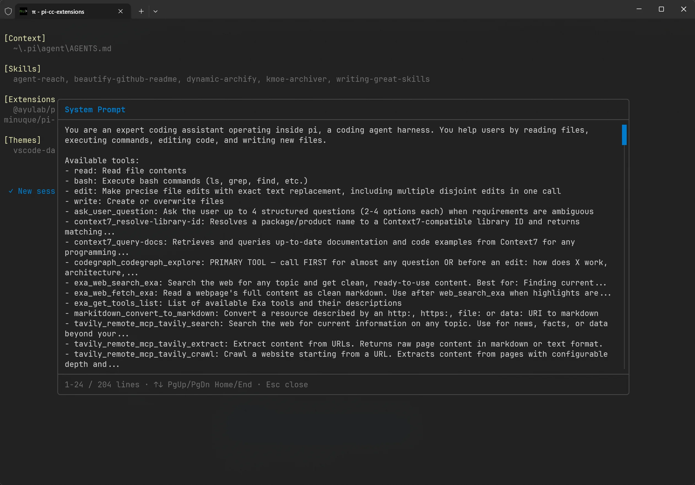

<p align="center">
  
</p>

<p align="center">
  <a href="https://pi.dev/packages?name=pi-cc-extensions"></a>
  <a href="https://www.npmjs.com/package/pi-cc-extensions"></a>
  <a href="#compatibility"></a>
  <a href="./extensions"></a>
</p>

<p align="center">
  Claude Code-style output, a fixed editor, context inspection, and Agent / Session references.
</p>

<p align="center">
  <a href="./README.md">简体中文</a> · <strong>English</strong>
</p>

---

## Preview

<table>
  <tr>
    <td colspan="2" align="center">
      
      <br>
      <sub><b>Welcome screen</b><br><code>npm:pi-startup-header</code> with <code>npm:pi-zentui</code></sub>
    </td>
  </tr>
  <tr>
    <td width="50%" align="center">
      
      <br>
      <sub><b>Fixed-editor workflow</b><br>Tool summaries, expand/collapse, and keyboard navigation</sub>
    </td>
    <td width="50%" align="center">
      
      <br>
      <sub><b>Session references</b><br>Find and inject previous context through completion</sub>
    </td>
  </tr>
  <tr>
    <td width="50%" align="center">
      
      <br>
      <sub><b>Context usage</b><br>Inspect usage by category</sub>
    </td>
    <td width="50%" align="center">
      
      <br>
      <sub><b>Context preview</b><br>Inspect the content injected into the model</sub>
    </td>
  </tr>
</table>

## Quick start

```bash
pi install npm:pi-cc-extensions
```

Run `/reload` after installation, then try:

```text
/ccstyle       # Configure output and fixed-editor interaction
/context       # Inspect context usage
@              # Complete Agents, Sessions, and files
```

## Features


| Feature                   | Description                                                                                      | Entry point         |
| --------------------------- | -------------------------------------------------------------------------------------------------- | --------------------- |
| Claude Code-style output | Tool summaries, expand/collapse, rich edit/write diffs, and `on` / `off` / `compact` modes | `/ccstyle` |
| Fixed-editor interaction | Powered by `@tifan/pi-fixed-editor`, with runtime toggling, five-row wheel scrolling, tool clicks, and back-to-bottom control | `/ccstyle` |
| Context inspection | Usage breakdown and previews for the system prompt, tools, skills, and messages | `/context` |
| Session references        | Search and inject effective context from previous Sessions or existing SubAgents                 | `@session:`         |
| Theme                     | Includes the GitHub Dark Default theme                                                           | `/theme`            |

### Output modes


| Mode      | Behavior                                                              |
| ----------- | ----------------------------------------------------------------------- |
| `on`      | Claude Code-style tool output with rich diffs for`edit` and `write`   |
| `off`     | Native Pi renderers                                                   |
| `compact` | One-line previews, merged repeated calls, duration, and run summaries |

```text
/ccstyle on
/ccstyle off
/ccstyle compact
/ccstyle status
```

Configuration is stored in `~/.pi/agent/claude-code-style.json`:

```json
{
  "mode": "on",
  "excludeRenderers": [],
  "fixedEditorFeatures": true,
  "toolMouseInteraction": true
}
```

- `excludeRenderers` uses exact tool names. `Agent` always keeps its dedicated renderer.
- `fixedEditorFeatures: true` enables `@tifan/pi-fixed-editor`, which captures mouse input for transcript scrolling and selection.
- `toolMouseInteraction: true` enables tool hover, click-to-expand, and `Ctrl+End`. With the fixed editor on, it also enables the back-to-bottom indicator and new-message count. With the fixed editor off, it still enables terminal mouse reporting, so native selection requires Shift.
- Set both options to `false`, or turn **Fixed editor** off in `/ccstyle`, to preserve native terminal wheel scrolling, selection, and context menus. Turning Fixed editor off in the panel also turns Tool mouse off; it can be re-enabled separately.
- Existing configs without `toolMouseInteraction` inherit the `fixedEditorFeatures` value, so an existing `fixedEditorFeatures: false` config automatically restores native terminal mouse behavior.
- Run `/reload` after editing the file manually.

### `@` references

- Enter `@session:` to reference a previous Session.
- Enter `@agent-name` to delegate to a custom Agent.
- Compatible with `@bacnh85/pi-fff` and `@tintinweb/pi-subagents`.
- Session context is deduplicated and size-limited before injection.

## Other installation methods

```bash
# GitHub
pi install git:github.com/minuque/pi-cc-extensions

# Local repository
pi install /absolute/path/to/pi-cc-extensions
```

## Local development

```bash
npm test
npm run typecheck
pi -e .
```

Run `/reload` after changing extensions.

## Compatibility

- Node.js `>=22.19.0`
- Loaded through `pi.extensions` and `pi.themes` in the root `package.json`
- If a Pi, TUI, or `@tifan/pi-fixed-editor` update causes display issues, try `/reload` first

## Recommended companions


| Extension                     | Purpose                                                      |
| ------------------------------- | -------------------------------------------------------------- |
| `npm:@tintinweb/pi-subagents` | Parallel SubAgents, background tasks, and worktree isolation |
| `npm:pi-mcp-adapter`          | On-demand MCP tool discovery with lower context usage        |
| `npm:pi-theme-picker`         | Theme search and live preview                                |
| `npm:@ayulab/pi-rewind`       | Checkpoint-based code or conversation rollback               |
| `npm:pi-compact-thinking`     | Compact rendering for hidden thinking blocks                 |

## Credits

- Compact transcript behavior is based on [`avhagedorn/pi-compact-transcript`](https://github.com/avhagedorn/pi-compact-transcript) v0.6.2 (MIT).
- Fixed-editor behavior is provided by [`@tifan/pi-fixed-editor`](https://github.com/tifandotme/pi-extensions/tree/master/packages/pi-fixed-editor) (MIT).
- Rich diffs are adapted from [`MasuRii/pi-tool-display`](https://github.com/MasuRii/pi-tool-display) (MIT). See [`extensions/tool-diff/ATTRIBUTION.md`](./extensions/tool-diff/ATTRIBUTION.md).
- Startup header based on [`EnderLiquid/pi-startup-header`](https://github.com/EnderLiquid/pi-startup-header) (MIT).
- Command aliases based on [`xRyul/pi-aliases`](https://github.com/xRyul/pi-aliases) (MIT).
