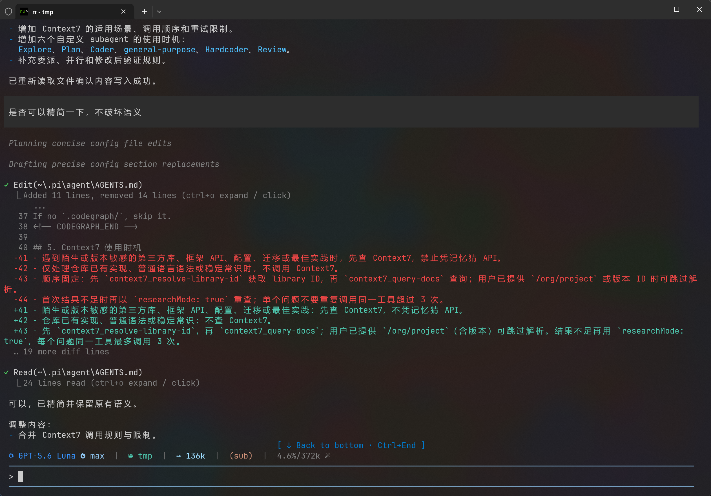

# pi-cc-extensions

> 借鉴了claude code tui 交互设计并结合了自己的喜好自定义扩展集合。



## 扩展

- `claude-code-style.ts`：Claude Code 风格界面、Powerline 状态栏、Bash 模式及工作提示。
- `context.ts`：通过 `/context` 查看当前上下文窗口分布。
- `session-reference/`：在提示词中使用 `@session:<session-id>` 引用历史 Session。

## 本地开发

```bash
npm test
pi -e .
```

也可将当前仓库作为本地包安装：

```bash
pi install /absolute/path/to/pi-cc-extensions
```

修改扩展后，在 Pi 中执行 `/reload`。

## Git 安装

仓库推送到 GitHub 后：

```bash
pi install git:github.com/OWNER/pi-cc-extensions
```

固定到发布标签：

```bash
pi install git:github.com/OWNER/pi-cc-extensions@v0.1.0
```

## 发布检查

```bash
npm test
npm pack --dry-run
```
