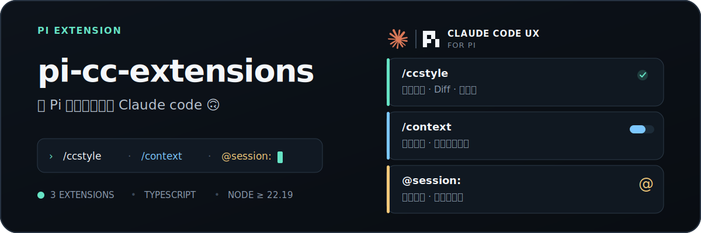
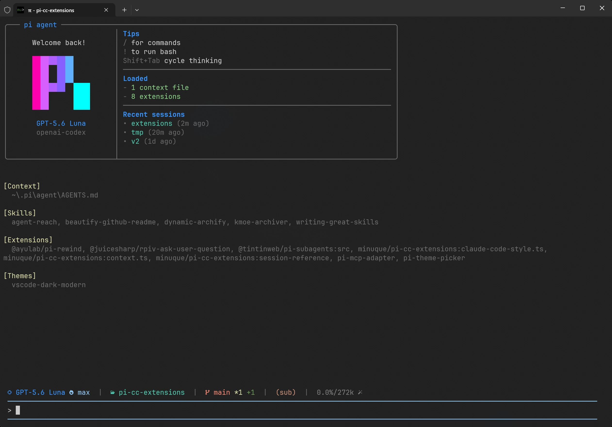
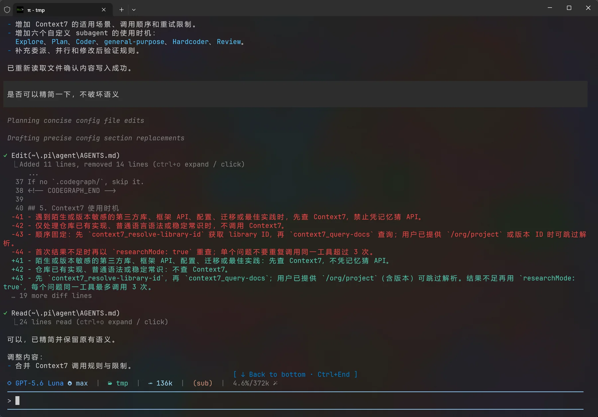
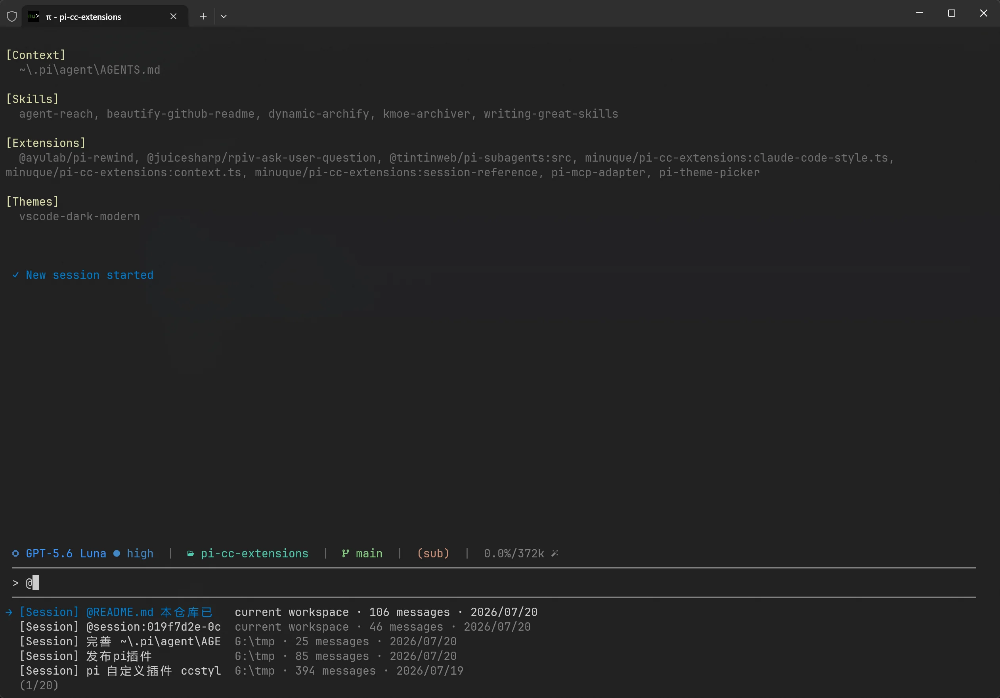
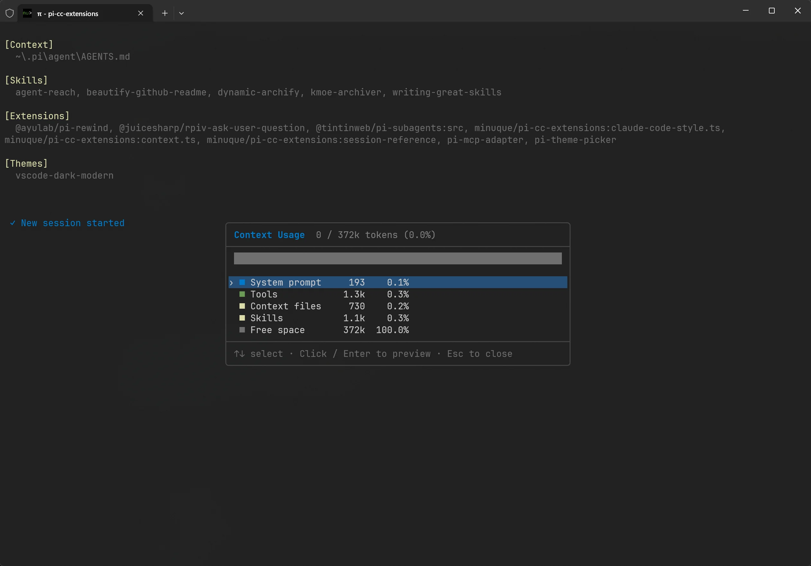
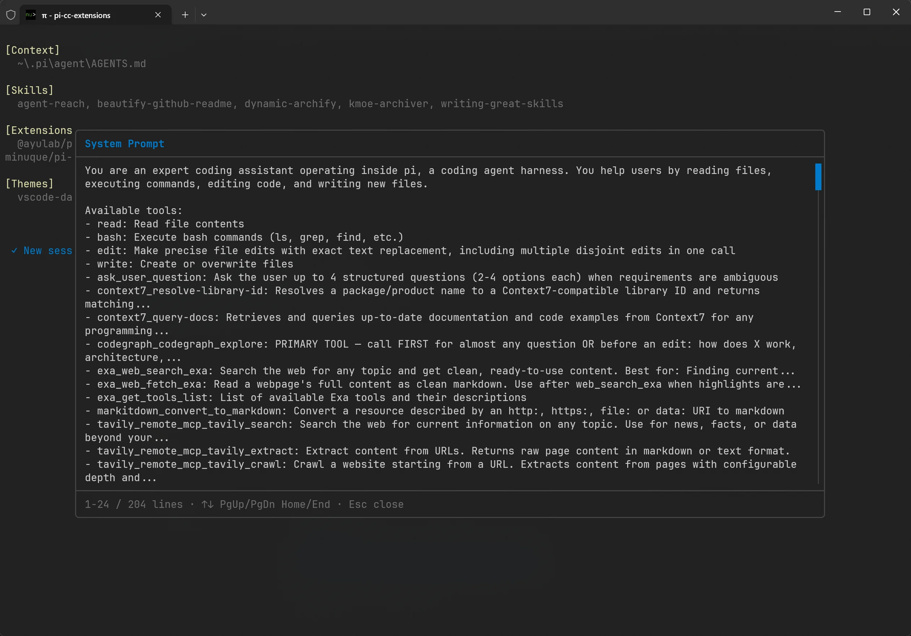

<p align="center">
  
</p>

<p align="center">
  <a href="#安装"></a>
  <a href="./package.json"></a>
  <a href="#兼容性"></a>
  <a href="./extensions"></a>
</p>

<p align="center">
  为 Pi 补充一套更接近 Claude Code 的终端工作流 · 上下文洞察 · 历史 Session 引用
</p>

---

## 截图

<table>
  <tr>
    <td colspan="2" align="center">
      
      <br>
      <sub><b>Welcome 界面</b><br>启动时查看已加载上下文、扩展与最近会话</sub>
    </td>
  </tr>
  <tr>
    <td width="50%" align="center">
      
      <br>
      <sub><b>Claude Code 风格界面</b><br>工具调用摘要、Diff 预览与 Powerline 状态栏</sub>
    </td>
    <td width="50%" align="center">
      
      <br>
      <sub><b>历史 Session 引用</b><br>通过 @ 补全快速找到并引用历史会话</sub>
    </td>
  </tr>
  <tr>
    <td width="50%" align="center">
      
      <br>
      <sub><b>上下文用量</b><br>查看 System prompt、Tools、Skills 等占用分布</sub>
    </td>
    <td width="50%" align="center">
      
      <br>
      <sub><b>上下文预览</b><br>按类别展开查看实际注入的上下文内容</sub>
    </td>
  </tr>
</table>

## 功能

### Claude Code 风格界面

`extensions/claude-code-style.ts` 提供：

- Claude Code 风格的工具调用行与结果摘要
- Powerline 状态栏和工作状态提示
- Edit / Write 的 Diff 预览
- 工具结果的折叠与展开
- `/ccstyle` 配置命令和 `Ctrl+Shift+O` 快捷键

常用命令：

```text
/ccstyle             # 切换开关
/ccstyle status      # 查看状态
/ccstyle compact     # 紧凑摘要
/ccstyle minimal     # 最小化输出
/ccstyle powerline   # 查看 Powerline 预设
```

### 上下文窗口查看

`extensions/context.ts` 注册 `/context`，展示当前上下文窗口的使用分布，并可进一步预览：

- System prompt
- Tools
- Context files
- Skills
- User / assistant messages
- Tool results
- Compaction summaries

### 历史 Session 引用

`extensions/session-reference/index.ts` 将历史 Session 接入 `@` 补全：

1. 在提示词中输入 `@`。
2. 从 `[Session] ...` 或 `[SubAgent] ...` 补全项中选择要引用的上下文。
3. 提交时以 `@session:<session-id>` 引用其当前有效上下文。

Session 模糊查询默认显示 5 个候选；若已加载 `pi-subagents`，也可直接引用现有 SubAgent。一次提示词可以引用多个 Session；扩展会自动去重，并限制注入规模以避免上下文无限膨胀。更多细节见 [`extensions/session-reference/README.md`](./extensions/session-reference/README.md)。

## 安装

从 npm 安装（推荐）：

```bash
pi install npm:pi-cc-extensions
```

或从 Git 安装：

```bash
pi install git:github.com/minuque/pi-cc-extensions
```

安装后可以先运行：

```text
/context
/ccstyle status
```

## 本地开发

```bash
npm test
pi -e .
```

也可以把当前仓库作为本地 Pi 包安装：

```bash
pi install /absolute/path/to/pi-cc-extensions
```

修改扩展后，在 Pi 中执行：

```text
/reload
```

## 兼容性

- Node.js `>=22.19.0`
- 作为 Pi package 加载，入口由根目录 `package.json` 的 `pi.extensions` 显式声明

## 发布

发布前检查：

```bash
npm test
npm pack --dry-run
```

使用 npm 发布。未指定 tag 时使用 `latest`：

```bash
npm run release
npm run release -- --tag next
npm run release -- --tag beta
```

## 致谢

本项目中的 Powerline 状态栏、Welcome 界面、Working Vibes 等功能基于 [nicobailon/pi-powerline-footer](https://github.com/nicobailon/pi-powerline-footer) 二次开发，感谢原作者的开源贡献。
