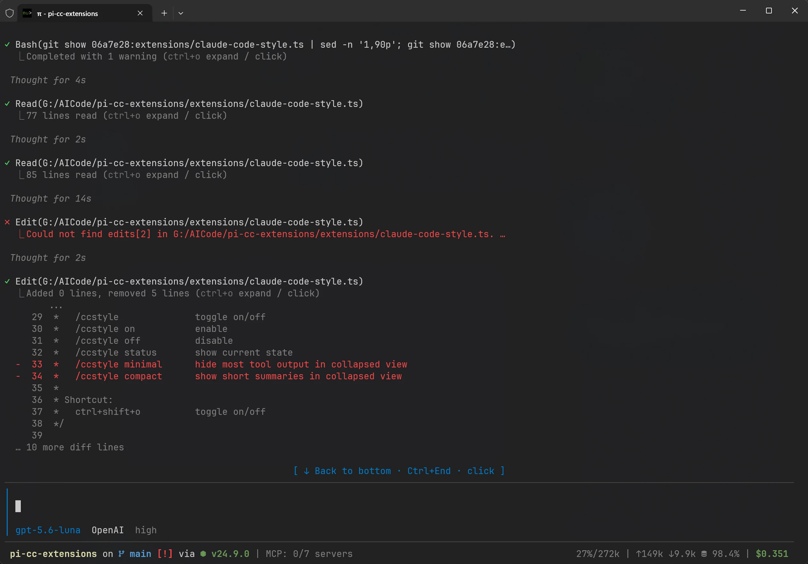

<p align="center">
  
</p>

<p align="center">
  <a href="https://pi.dev/packages?name=pi-cc-extensions"></a>
  <a href="https://www.npmjs.com/package/pi-cc-extensions"></a>
  <a href="#兼容性"></a>
  <a href="./extensions"></a>
</p>

<p align="center">
  面向 Pi 的终端效率扩展套件 · Claude Code 风格界面 · 上下文检查 · Agent 与 Session 引用
</p>

---

## 界面预览

<table>
  <tr>
    <td colspan="2" align="center">
      
      <br>
      <sub><b>欢迎界面</b><br> @ <code>npm:pi-startup-header</code> 与 <code>npm:pi-zentui</code></sub>
    </td>
  </tr>
  <tr>
    <td width="50%" align="center">
      
      <br>
      <sub><b>固定编辑器工作流</b><br>工具结果摘要、折叠展开与键盘导航</sub>
    </td>
    <td width="50%" align="center">
      
      <br>
      <sub><b>历史 Session 引用</b><br>通过 @ 补全快速找到并引用历史会话</sub>
    </td>
  </tr>
  <tr>
    <td width="50%" align="center">
      
      <br>
      <sub><b>上下文用量</b><br>查看 System prompt、Tools、Skills 等占用分布</sub>
    </td>
    <td width="50%" align="center">
      
      <br>
      <sub><b>上下文预览</b><br>按类别展开查看实际注入的上下文内容</sub>
    </td>
  </tr>
</table>

## 功能

### Claude Code 风格界面

`extensions/claude-code-style.ts` 提供：

- `on`：Claude Code 风格的工具调用行与结果摘要（默认覆盖普通工具 renderer）
- `off`：使用 Pi 原生输出
- `compact`：单行工具预览、运行状态与耗时、连续同名工具合并、失败独立行、运行总结，以及隐藏 thinking 时的标题 ticker
- Pi 默认输入栏
- 通过 `excludeRenderers` 保留指定工具的原生或扩展 renderer；`Agent` 始终保留专用 renderer
- 工具结果的折叠与展开；切换模式会立即重绘已有 transcript
- 类 Claude Code 滚动到底部 button

常用命令：

```text
/ccstyle             # 打开交互式配置面板
/ccstyle on          # Claude Code 风格
/ccstyle off         # Pi 原生输出
/ccstyle compact     # 紧凑 transcript 风格
/ccstyle status      # 查看当前模式
```

需要保留指定工具的原生或扩展 renderer 时，编辑 `~/.pi/agent/claude-code-style.json`：

```json
{
  "mode": "compact",
  "excludeRenderers": ["edit", "write"]
}
```

`mode` 可取 `on`、`off` 或 `compact`。旧版 `enabled: true/false` 会自动迁移为 `on/off`。排除名单使用精确工具名；手动修改配置后执行 `/reload`。`Agent` 的专用 renderer 始终保留。


Compact transcript 行为改编自 [avhagedorn/pi-compact-transcript](https://github.com/avhagedorn/pi-compact-transcript) v0.6.2（MIT，Alan Hagedorn）。

### 上下文窗口查看

`extensions/context.ts` 注册 `/context`，展示当前上下文窗口的使用分布，并可进一步预览：

- System prompt
- Tools
- Context files
- Skills
- User / assistant messages
- Tool results
- Compaction summaries

### 历史 Session 引用

`extensions/session-reference.ts` 将历史 Session 接入 `@` 补全：

1. 在提示词中输入 `@`。
2. 从 `[Session] ...` 或 `[SubAgent] ...` 补全项中选择要引用的上下文。
3. 提交时以 `@session:<session-id>` 引用其当前有效上下文。

Session 模糊查询默认显示 3 个候选，并与文件候选按 1:2 交错排列；路径型查询优先显示文件。若已加载 `pi-subagents`，也可直接引用现有 SubAgent。一次提示词可以引用多个 Session；扩展会自动去重，并限制注入规模以避免上下文无限膨胀。

### SubAgent `@` 补全

`extensions/agent-autocomplete.ts` 将 `~/.pi/agent/agents/*.md` 中定义的 SubAgent 接入 `@` 补全：

1. 在提示词中输入 `@agent-name`。
2. 从补全列表中选择 SubAgent。
3. 提交后自动注入委托指令；提示词中提到的每个 SubAgent 都会分别交由 Agent 工具处理。

该补全不会占用 `@session:` 的历史 Session 引用语法；与 `@bacnh85/pi-fff` 同时启用时，SubAgent、Session 和 FFF 文件候选会合并显示。修改 SubAgent 定义后执行 `/reload` 即可重新加载。

## 安装

从 npm 安装（推荐）：

```bash
pi install npm:pi-cc-extensions
```

或从 Git 安装：

```bash
pi install git:github.com/minuque/pi-cc-extensions
```

安装后可以先运行：

```text
/context
/ccstyle on
```

## 本地开发

```bash
npm test
pi -e .
```

也可以把当前仓库作为本地 Pi 包安装：

```bash
pi install /absolute/path/to/pi-cc-extensions
```

修改扩展后，在 Pi 中执行：

```text
/reload
```

## 兼容性

- Node.js `>=22.19.0`
- 作为 Pi package 加载，入口由根目录 `package.json` 的 `pi.extensions` 显式声明

## 扩展推荐


| 扩展                                     | 作用                                                                          |
| ------------------------------------------ | ------------------------------------------------------------------------------- |
| `npm:pi-theme-picker`                    | 通过`/theme` 交互式切换 Pi 主题，支持模糊搜索和实时预览                       |
| `npm:@juicesharp/rpiv-ask-user-question` | 提供`ask_user_question` 结构化问卷工具，支持单选、多选、预览和备注            |
| `npm:pi-mcp-adapter`                     | 将 MCP 服务接入 Pi，并通过代理工具按需发现，减少上下文占用                    |
| `npm:@tintinweb/pi-subagents`            | Claude Code 风格的并行 SubAgent、后台任务、任务编排、工作树隔离和自定义 Agent |
| `npm:@ayulab/pi-rewind`                  | 基于 checkpoint 的`/rewind` 回退，支持分别恢复代码、对话或两者                |
| `npm:pi-compact-thinking`                | 将隐藏的思考块渲染为紧凑、带动画的推理预览                                    |
| `npm:pi-startup-header`                  | 用跟随当前主题配色的渐变 ASCII 标题替换默认启动头                             |
| `npm:pi-zentui`                          | Starship 风格状态栏与 Opencode 风格编辑器，支持固定编辑器和 Git 状态          |

### 使用注意

- `pi-cc-extensions` 与 `pi-zentui` 都会修改 Pi 的 TUI / renderer。若出现布局或渲染冲突，建议先确定一个作为主要界面扩展，另一个按需停用。
- `pi-mcp-adapter` 默认延迟连接 MCP 服务，有助于节省上下文；包含凭据的 MCP 配置不要提交到仓库。
- `pi-compact-thinking` 和 `pi-zentui` 都涉及 Pi 内部 UI 行为，升级 Pi 后若出现异常，优先执行 `/reload` 或暂时停用对应扩展。
