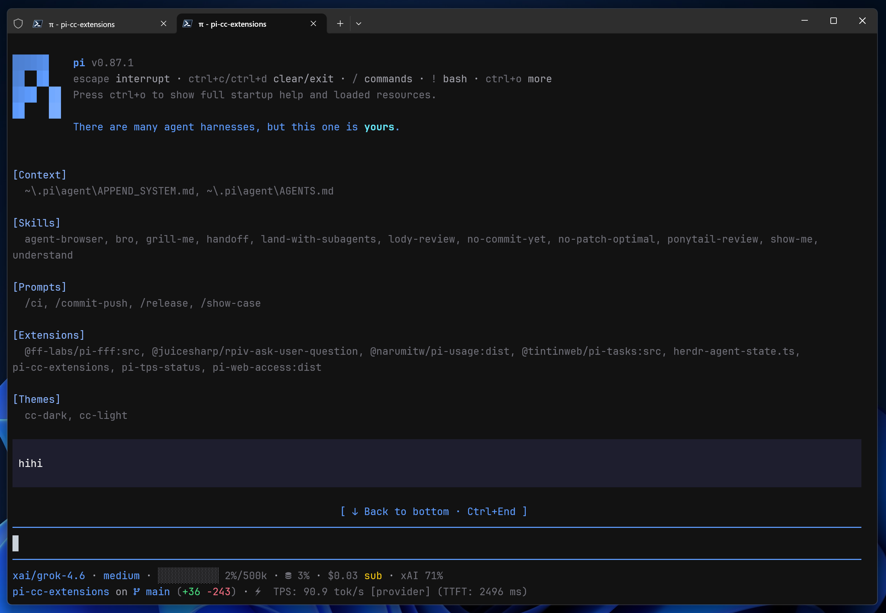

<p align="center">
  <strong>简体中文</strong> · <a href="./README.en.md">English</a>
</p>

# pi-cc-extensions

> 类 Claude Code TUI 输出风格，并融入了一些个人喜好，和一些实用小功能。

## 界面预览

<a href="https://github.com/user-attachments/assets/6c858000-fdad-43f9-957f-4d0278648498"></a>

点击封面播放演示视频

## 快速开始

```bash
pi install npm:pi-cc-extensions

# GitHub
pi install git:github.com/minuque/pi-cc-extensions
```

安装后执行 `/reload`

## 功能

| 功能                  | 说明                                                                            | 入口                                            |
| --------------------- | ------------------------------------------------------------------------------- | ----------------------------------------------- |
| Claude Code UI        | 工具摘要、折叠展开、rich edit/write diff，以及`on` / `compact` / `off` 三种模式 | `/ccstyle`                                      |
| Markdown 增强         | Mermaid 图、提示框、URL 链接化等                                                        | 自动生效                                        |
| Fullscreen mode       | 工具卡/group 单击展开、双击收起、预览、hover 高亮、回到底部按钮                 | `TUIMODE=fullscreen` 或 `--tui-mode fullscreen` |
| 配置面板              | `Style / Features / UI / Diff / Thinking / Footer` 六页签                       | `/ccstyle`                                      |
| 上下文检查            | 查看上下文占用，并预览 System prompt、Memory、Skills、Tools definition 和消息内容 | `/context`                                      |
| Session/Subagent 引用 | 搜索并注入历史 Session 或现有 SubAgent 的有效上下文                             | `@`                                             |
| 状态栏                | 显示：模型、上下文、缓存、费用、git并适配 @narumitw/pi-usage 实时显示额度；git/缓存图标可关 Nerd Font | `/ccstyle`                              |
| 主题                  | 随包提供内置 CC Dark、CC Light 主题                                             | `/theme`                                        |

`on` / `compact` 两种模式的渲染样例：[默认模式](./docs/tool-render-examples-default.md) · [紧凑模式](./docs/tool-render-examples-compact.md)

## 配置

`/ccstyle` 的行为由 `~/.pi/agent/pi-cc-extensions.json` 配置：

```jsonc
{
  // style
  "mode": "on",                            // on / compact / off
  "excludeRenderers": [],                  // 走原生渲染的工具名；Agent 始终保留专用渲染器
  "mcpServerTitles": true,                 // MCP 工具调用从结果提取 MCP server 作标题；关闭时显示 MCP

  // features
  "enableSessionReference": true,          // @ session 引用
  "enableSubagentAutocomplete": true,      // @ subagent 补全与委派提示
  "enableContextCommand": true,            // /context 上下文检查
  "enableAgentSummary": true,              // 每回合工具摘要
  "enableWorkingMessage": true,            // Working... 底部 token/耗时
  "enableAliases": true,                   // /clear、/exit 别名

  // ui
  "expandedInputMaxLines": 5,              // 展开工具卡 Input 可见行数，超出在末行显示展开提示
  "expandedOutputMaxLines": 10,            // 展开工具卡 Output 可见行数，超出在末行显示展开提示
  "expandedPreviewMaxLines": 40,           // 展开 diff/TaskList 正文最大行数
  "inputClip": 100,                        // 工具摘要 path/command 折叠字符数
  "showStartupHeader": true,               // 启动头（logo + tips）开关
  "scrollStepLines": 3,                    // fullscreen 滚轮步进

  // diff
  "diffViewMode": "auto",                  // 布局：auto / split / unified
  "diffIndicatorMode": "bars",             // 变更指示：bars / classic / none
  "diffSplitMinWidth": 120,                // 左右分栏的最小终端宽度
  "editDiffCollapsedLines": 24,            // Edit 折叠行数，超出显示展开提示
  "writeDiffCollapsedLines": 0,            // write 折叠行数，0 仅显示创建摘要
  "diffWordWrap": true,                    // 长 diff 行换行

  // thinking
  "useSummaryTitlesAsThinkingTitle": true, // 用最新摘要作思考标题
  "previewLines": 3,                       // 预览行数，0 隐藏
  "animationIntervalMs": 90,               // 标题动画间隔（毫秒）
  "dimThinkingText": false,                // thinking 正文用 dim 色

  // footer
  "enableCustomFooter": true,              // 自定义状态栏
  "footerNerdIcons": true,                 // git/缓存用 Nerd Font 图标；false 为纯文本
  "footerHiddenKeys": [],                  // 隐藏的插件芯片 key
  "footerLine1Keys": ["pi-usage"],         // line1 插件芯片顺序；pi-usage 默认显示，数据来自 @narumitw/pi-usage
  "footerLine2Keys": [],                   // line2 插件芯片顺序（接在 cwd/git 后）
  "footerLine3Keys": []                    // line3 备用槽，有可见芯片才占行
}
```

> [!TIP]
> **全屏模式**：单击 `click to show more` 展开工具卡、思考、Skill 和 compact 摘要；展开后 Input/Output 超行时，末行 `… +N more lines • click to show more` 打开全量预览，双击展开面板收起。

> [!NOTE]
> **Mermaid 渲染**：建议把 `markdown.mermaid` 设为 `final`（`~/.pi/agent/settings.json` 或 `/settings` 面板的 Mermaid diagrams 选项）。默认 `streaming` 逐帧重绘，`final` 渲染最终版更稳定。

## 本地开发

```bash
npm test
npm run typecheck
./test.bat # or pi -e .
```

## 兼容性

- Node.js `>=22.19.0`，Pi `^0.84.0`

## 推荐搭配

| 扩展                                     | 用途                                             |
| ---------------------------------------- | ------------------------------------------------ |
| `npm:@tintinweb/pi-subagents`            | 并行 SubAgent、后台任务与工作树隔离              |
| `npm:@tintinweb/pi-tasks`                | Claude Code 风格任务跟踪与协调                   |
| `npm:pi-mcp-adapter`                     | 按需发现 MCP 工具，减少上下文占用                |
| `npm:@ff-labs/pi-fff`                    | 模糊文件与内容检索（fffind / ffgrep）            |
| `npm:pi-web-access`                      | 网页搜索、URL 抓取、GitHub 克隆、PDF/视频解析    |
| `npm:@narumitw/pi-usage`                 | 查看当前账号用量（Codex / Copilot / OpenRouter） |

## 致谢

- Rich diff 改编自 [`MasuRii/pi-tool-display`](https://github.com/MasuRii/pi-tool-display)（MIT）；详见 [`extensions/renderer/tool/diff/ATTRIBUTION.md`](./extensions/renderer/tool/diff/ATTRIBUTION.md)。

## 许可证

[MIT](./LICENSE) © minuque
